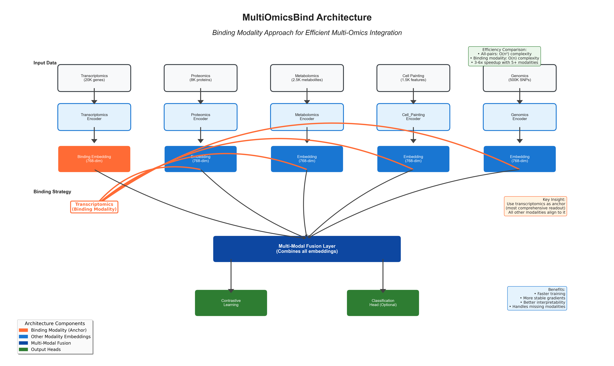

# MultiOmicsBind

[](https://www.python.org/downloads/)
[](https://pytorch.org/)
[](https://opensource.org/licenses/Apache-2.0)

**MultiOmicsBind** is a deep learning framework for integrating and analyzing multi-omics data using contrastive learning and neural encoders. It enables unified representation learning across different biological data modalities such as transcriptomics, proteomics, metabolomics, and imaging features.

## 🧬 Overview

Multi-omics data integration is a critical challenge in systems biology and precision medicine. MultiOmicsBind addresses this by:

- **Unified Embeddings**: Learning shared representations across different omics modalities
- **Contrastive Learning**: Using self-supervised learning to align related samples across modalities
- **Flexible Architecture**: Supporting any combination of omics data types and metadata
- **Downstream Tasks**: Enabling both unsupervised exploration and supervised prediction

## 🏗️ Architecture



MultiOmicsBind consists of several key components:

1. **Modality-Specific Encoders**: Neural networks that transform raw omics data into fixed-size embeddings
2. **Metadata Encoder**: Handles categorical and numerical metadata (drugs, cell lines, doses, etc.)
3. **Contrastive Learning**: Aligns embeddings from the same sample across different modalities
4. **Classification Head** *(optional)*: For supervised learning tasks
5. **Multi-Modal Fusion**: Combines embeddings for downstream analysis

### Key Features

- 🔬 **Multi-Modal Integration**: Seamlessly combine transcriptomics, proteomics, cell painting, metabolomics, genomics, imaging, and any other omics data types
- 🎯 **Contrastive Learning**: Self-supervised alignment of multi-modal data
- 📊 **Metadata Support**: Incorporate experimental metadata (drugs, doses, cell lines)
- 🔍 **Interpretability**: Built-in tools for feature importance and embedding analysis
- ⚡ **Scalable**: Efficient PyTorch implementation with GPU support for any number of modalities and features
- 🧪 **Flexible**: Support for both unsupervised and supervised learning with customizable architectures

## 📦 Installation

### From Source

```bash
git clone https://github.com/shivaprasad-patil/MultiOmicsBind.git
cd MultiOmicsBind
pip install -e .
```

### Dependencies

- Python ≥ 3.8
- PyTorch ≥ 1.9.0
- pandas ≥ 1.3.0
- numpy ≥ 1.21.0
- scikit-learn ≥ 1.0.0
- matplotlib ≥ 3.4.0
- seaborn ≥ 0.11.0

Optional dependencies:
```bash
pip install umap-learn  # For UMAP visualization
```

## 🚀 Quick Start

### Basic Usage

```python
import torch
from multiomicsbind import MultiOmicsBindWithHead, MultiOmicsDataset, train_multiomicsbind

# 1. Prepare your data (any number of modalities)
data_paths = {
    'transcriptomics': 'tx_data.csv',      # e.g., 20,000 genes
    'proteomics': 'pr_data.csv',           # e.g., 8,000 proteins  
    'cell_painting': 'cp_data.csv',        # e.g., 1,500 morphological features
    'metabolomics': 'met_data.csv',        # e.g., 2,500 metabolites
    'genomics': 'gen_data.csv',            # e.g., 500,000 SNPs
    # Add as many modalities as needed
}

dataset = MultiOmicsDataset(
    data_paths=data_paths,
    metadata_path='metadata.csv',
    cat_cols=['drug', 'cell_line'],
    num_cols=['dose'],
    label_col='response'
)

# 2. Initialize model (automatically adapts to your data dimensions)
input_dims = dataset.get_input_dims()  # Auto-detects feature counts per modality
cat_dims, num_dims = dataset.get_metadata_dims()

model = MultiOmicsBindWithHead(
    input_dims=input_dims,  # e.g., {"transcriptomics": 20000, "proteomics": 8000, ...}
    cat_dims=cat_dims,      # Categorical metadata dimensions
    num_dims=num_dims,      # Numerical metadata dimensions
    embed_dim=768,          # Unified embedding dimension
    num_classes=3           # For classification (optional)
)

# 3. Train the model
device = torch.device("cuda" if torch.cuda.is_available() else "cpu")
model = model.to(device)

dataloader = torch.utils.data.DataLoader(dataset, batch_size=32, shuffle=True)
optimizer = torch.optim.AdamW(model.parameters(), lr=1e-4)

trained_model = train_multiomicsbind(
    model=model,
    dataloader=dataloader,
    optimizer=optimizer,
    device=device,
    epochs=50,
    use_classification=True
)

# 4. Extract embeddings
embeddings = model.encode(sample_data)
```

### Data Format

Your data should be in CSV format with the following structure:

**Omics Data Files** (any number of modalities, any number of features):
```
# transcriptomics.csv (example: 20,000 genes, but can be any number)
sample_id,gene_1,gene_2,...,gene_n
sample_001,0.5,-1.2,...,2.1
sample_002,1.1,0.8,...,-0.5

# proteomics.csv (example: 8,000 proteins, but can be any number)  
sample_id,protein_1,protein_2,...,protein_n
sample_001,2.1,0.3,...,-0.8
sample_002,-1.5,1.9,...,0.4

# Any additional modality follows the same format
# metabolomics.csv, genomics.csv, imaging.csv, etc.
```

**Metadata File** (`metadata.csv`):
```
sample_id,drug,cell_line,dose,response
sample_001,Drug_A,HeLa,1.0,High
sample_002,Drug_B,MCF7,5.0,Low
...
```

## 📖 Examples

### Basic Example

```python
# Run the basic example
python examples/basic_example.py
```

This example demonstrates:
- Loading synthetic multi-omics data
- Training a MultiOmicsBind model
- Evaluating performance
- Creating visualizations

### Advanced Analysis

```python
# Run advanced analysis
python examples/advanced_analysis.py
```

This example shows:
- Feature importance analysis
- Embedding visualization with UMAP
- Cross-modal similarity analysis
- Detailed classification metrics

### Flexible Modalities Example

```python
# Run flexibility demonstration
python examples/flexible_modalities_example.py
```

This example demonstrates:
- Scaling from 3 to 6+ modalities
- Handling feature dimensions from 200 to 50,000+
- Adding custom modality types (genomics, imaging, etc.)
- Performance comparison across different scales

## 🔧 API Reference

### Customizing Modalities

MultiOmicsBind is designed to be highly flexible. You can easily customize:

#### Adding New Modalities
```python
# Example: Adding custom modalities
data_paths = {
    'transcriptomics': 'tx_data.csv',      # 20,000 genes
    'proteomics': 'pr_data.csv',           # 8,000 proteins  
    'metabolomics': 'met_data.csv',        # 2,500 metabolites
    'genomics': 'snp_data.csv',            # 500,000 SNPs
    'imaging': 'image_features.csv',       # 10,000 image features
    'clinical': 'clinical_data.csv',       # 50 clinical measurements
    # Add any custom modality here
}
```

#### Handling Different Feature Scales
```python
# The framework automatically handles different feature dimensions:
input_dims = {
    'small_modality': 100,        # 100 features
    'medium_modality': 10000,     # 10K features  
    'large_modality': 500000      # 500K features
}

# Model automatically adapts encoders to each dimension
model = MultiOmicsBindWithHead(input_dims=input_dims, ...)
```

#### Custom Data Types
```python
# Different data types are supported:
# - Continuous: gene expression, protein levels
# - Binary: mutation status, drug response
# - Categorical: cell types, treatments (via metadata)
# - Count: read counts, cell counts
```

### Core Classes

#### `MultiOmicsBindWithHead`

Main model class for multi-omics integration.

```python
model = MultiOmicsBindWithHead(
    input_dims={"transcriptomics": 20000, "proteomics": 8000, "metabolomics": 2500},  # Any number of modalities
    cat_dims=[10, 5],  # 10 drugs, 5 cell lines
    num_dims=1,        # 1 numerical feature (dose)
    embed_dim=768,     # Embedding dimension
    num_classes=3      # Number of output classes (optional)
)
```

#### `MultiOmicsDataset`

PyTorch dataset for loading and preprocessing multi-omics data.

```python
dataset = MultiOmicsDataset(
    data_paths={"transcriptomics": "tx.csv", "proteomics": "pr.csv", "metabolomics": "met.csv"},  # Any modalities
    metadata_path="metadata.csv",
    cat_cols=["drug", "cell_line"],
    num_cols=["dose"],
    label_col="response"
)
```

### Training Functions

#### `train_multiomicsbind`

Main training function with support for both contrastive and classification objectives.

```python
trained_model = train_multiomicsbind(
    model=model,
    dataloader=dataloader,
    optimizer=optimizer,
    device=device,
    epochs=50,
    temperature=0.07,
    use_classification=True,
    contrastive_weight=1.0,
    classification_weight=1.0
)
```

### Visualization Functions

```python
from multiomicsbind.utils import (
    plot_architecture,
    plot_training_history,
    plot_embeddings_umap,
    plot_feature_importance
)

# Plot model architecture
plot_architecture(save_path="architecture.png")

# Plot training curves
plot_training_history(model.training_history, save_path="training.png")

# Visualize embeddings
plot_embeddings_umap(embeddings, labels, save_path="umap.png")
```

## 🎯 Use Cases

### 1. Drug Discovery
- Integrate transcriptomics and cell painting data to predict drug responses
- Identify biomarkers across multiple data modalities
- Understand drug mechanisms through multi-omics analysis

### 2. Disease Research
- Combine genomics, proteomics, and clinical data for disease subtyping
- Discover disease biomarkers across multiple omics layers
- Predict patient outcomes using integrated omics profiles

### 3. Systems Biology
- Study biological pathways across multiple molecular levels
- Understand gene-protein-metabolite interactions
- Identify key regulatory networks in biological systems

### 4. Precision Medicine
- Personalized treatment recommendations based on multi-omics profiles
- Biomarker discovery for patient stratification
- Drug repurposing using integrated omics signatures

## 🔬 How It Works

### 1. Modality Encoding
Each omics modality (regardless of size) is processed by a dedicated neural encoder that transforms high-dimensional data into a unified embedding space:

```python
class OmicsEncoder(nn.Module):
    def __init__(self, input_dim, embed_dim=768):  # input_dim can be any size
        super().__init__()
        self.encoder = nn.Sequential(
            nn.Linear(input_dim, embed_dim),  # Handles any input dimension
            nn.LayerNorm(embed_dim),
            nn.ReLU(),
            nn.Dropout(0.2),
            nn.Linear(embed_dim, embed_dim)
        )
```

### 2. Contrastive Learning
The model learns to align embeddings from the same sample across different modalities using InfoNCE loss:

```
L_contrastive = -log(exp(sim(z_i, z_j)/τ) / Σ_k exp(sim(z_i, z_k)/τ))
```

Where `z_i` and `z_j` are embeddings from the same sample in different modalities.

### 3. Multi-Modal Fusion
Embeddings from any number of modalities are combined using mean pooling for downstream tasks:

```python
# Works with any number of modalities
combined_embedding = torch.mean(torch.stack(embeddings.values()), dim=0)
```

### 4. Optional Classification
A classification head can be added for supervised learning:

```python
self.classifier = nn.Sequential(
    nn.LayerNorm(embed_dim),
    nn.Linear(embed_dim, embed_dim // 2),
    nn.ReLU(),
    nn.Dropout(0.3),
    nn.Linear(embed_dim // 2, num_classes)
)
```

## 🧪 Model Interpretability

MultiOmicsBind provides several tools for model interpretation:

### Feature Importance
Use gradient-based attribution to identify important features:

```python
def get_feature_importance(model, inputs, target_class):
    gradients = torch.autograd.grad(
        outputs=logits[0, target_class],
        inputs=input_data,
        retain_graph=True
    )[0]
    return gradients.abs().mean(dim=0)
```

### Embedding Analysis
Visualize learned embeddings using UMAP or t-SNE:

```python
embeddings = model.encode(data)
plot_embeddings_umap(embeddings, labels)
```

### Cross-Modal Similarity
Analyze how well different modalities are aligned:

```python
similarity = torch.cosine_similarity(embedding_1, embedding_2, dim=1)
```

## 📊 Performance Tips

### 1. Data Preprocessing
- **Normalization**: Always normalize your omics data (z-score or min-max)
- **Feature Selection**: Consider reducing dimensionality for very high-dimensional data
- **Missing Data**: Handle missing values appropriately (imputation or masking)

### 2. Model Configuration
- **Embedding Dimension**: Start with 256-768, adjust based on data complexity
- **Batch Size**: Use larger batches (64-128) for stable contrastive learning
- **Learning Rate**: Start with 1e-4, use learning rate scheduling

### 3. Training Strategies
- **Warm-up**: Start with contrastive learning only, then add classification
- **Early Stopping**: Monitor validation loss to prevent overfitting
- **Gradient Clipping**: Use gradient clipping for training stability

### 4. Hardware Recommendations
- **GPU Memory**: Minimum 8GB for moderate datasets, 16GB+ for large datasets
- **CPU**: Multi-core CPU for data loading parallelization
- **Storage**: SSD recommended for faster data loading

## 🤝 Contributing

We welcome contributions! Please see our [Contributing Guidelines](CONTRIBUTING.md) for details.

### Development Setup

```bash
git clone https://github.com/shivaprasad-patil/MultiOmicsBind.git
cd MultiOmicsBind
pip install -e ".[dev]"
```

### Running Tests

```bash
pytest tests/
```

## 📄 License

This project is licensed under the Apache License 2.0 - see the [LICENSE](LICENSE) file for details.

## 📚 Citation

If you use MultiOmicsBind in your research, please cite:

```bibtex
@software{multiomicsbind2025,
  title={MultiOmicsBind: A Deep Learning Framework for Multi-Omics Data Integration},
  author={Shivaprasad Patil},
  year={2025},
  url={https://github.com/shivaprasad-patil/MultiOmicsBind}
}
```

## 🙏 Acknowledgments

- Thanks to the PyTorch team for the excellent deep learning framework
- Inspired by [ImageBind](https://imagebind.metademolab.com) from Meta's FAIR team for pioneering multi-modal representation learning
- Built on recent advances in contrastive learning and multi-modal AI
- Developed for the scientific community working on multi-omics data integration

## 📞 Support

- 🐛 **Bug Reports**: [GitHub Issues](https://github.com/shivaprasad-patil/MultiOmicsBind/issues)
- 💬 **Discussions**: [GitHub Discussions](https://github.com/shivaprasad-patil/MultiOmicsBind/discussions)
- 📧 **Email**: shivaprasad309319@gmail.com

---

*MultiOmicsBind: Bridging the gap between multi-omics data and biological insights* 🧬✨
