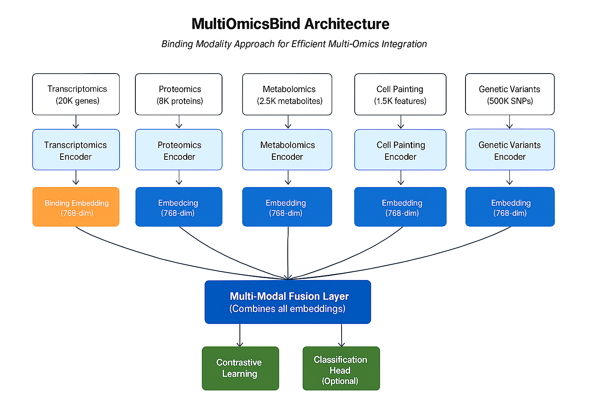

# MultiOmicsBind

[](https://www.python.org/downloads/)
[](https://pytorch.org/)
[](https://opensource.org/licenses/Apache-2.0)

**MultiOmicsBind** is a deep learning framework for integrating and analyzing multi-omics data using contrastive learning and neural encoders. Inspired by [ImageBind](https://imagebind.metademolab.com) from Meta AI, it enables unified representation learning across different biological data modalities.

## 🧬 Overview

Multi-omics data integration is a critical challenge in systems biology and precision medicine. MultiOmicsBind addresses this by:

- **🎯 Unified Embeddings**: Learning shared representations across different omics modalities
- **🔗 Binding Modality**: Revolutionary O(n) complexity approach inspired by ImageBind
- **📊 Contrastive Learning**: Self-supervised alignment of multi-modal biological data
- **🧪 Flexible Architecture**: Supporting any combination of omics data types and metadata
- **🚀 Downstream Tasks**: Enabling both unsupervised exploration and supervised prediction
- **⚡ Simplified API** *(NEW)*: Train and analyze models with single function calls

## ✨ What's New in v0.1.2

**High-Level API Functions** - Dramatically simplified workflows:

- `train_temporal_model()` - Complete training pipeline (replaces 150+ lines)
- `evaluate_temporal_model()` - Full evaluation with embeddings
- `compute_feature_importance()` - Gradient-based feature analysis
- `compute_cross_modal_similarity()` - Cross-modal alignment analysis
- `create_analysis_report()` - One-line comprehensive analysis
- Enhanced visualizations and utilities

**Result**: 99% less boilerplate code while maintaining full flexibility!

## 🧬 Overview



### Core Components

1. **🔬 Modality-Specific Encoders**: Neural networks transforming raw omics data into 768-dim embeddings
2. **📋 Metadata Encoder**: Handles experimental metadata (drugs, cell lines, doses, conditions)
3. **🎯 Contrastive Learning**: Aligns embeddings from same sample across different modalities
4. **🧠 Classification Head** *(optional)*: For supervised learning tasks
5. **🔄 Multi-Modal Fusion**: Combines embeddings via mean pooling for downstream analysis

### 🔗 Binding Modality Innovation

**Key Innovation**: MultiOmicsBind introduces **Binding Modality**, inspired by Meta's ImageBind:

| Approach | Complexity | Comparisons | Memory | Speed | Best For |
|----------|------------|-------------|---------|-------|----------|
| **All-Pairs** | O(n²) | n×(n-1)/2 | Quadratic | 1x | 2-3 modalities |
| **Binding Modality** | **O(n)** | **n-1** | **Linear** | **5x+** | **4+ modalities** |

**Benefits:**
- ⚡ **5x+ Faster Training** with multiple modalities
- 🧠 **Linear Memory Scaling** instead of quadratic
- 🎯 **Biological Interpretability** via meaningful anchor selection
- 🔄 **Missing Data Robustness** when non-anchor modalities are absent
- 🚀 **Emergent Cross-Modal Abilities** for zero-shot retrieval

---

## 📦 Installation

### Quick Install

```bash
git clone https://github.com/shivaprasad-patil/MultiOmicsBind.git
cd MultiOmicsBind
pip install -e .
```

### Requirements

- **Python**: 3.8 or higher
- **PyTorch**: 1.9 or higher
- **Core Dependencies**: NumPy, Pandas, scikit-learn
- **Optional**: UMAP-learn (for visualizations)

---

## � Input Data Requirements

### Data Format

MultiOmicsBind expects your input data in **CSV format** with specific requirements:

#### ✅ File Structure
```
your_data.csv:
sample_id,feature_1,feature_2,...,feature_N
sample_001,0.234,-1.456,...,0.891
sample_002,1.123,-0.234,...,-0.567
...
```

**Critical Requirements:**
- ✅ Each CSV must have a `sample_id` column
- ✅ All modality files must have samples in the **same order**
- ✅ Feature columns should contain numerical values
- ✅ Missing values (NaN) are supported and handled automatically

### Data Normalization

**Important**: MultiOmicsBind works best with **standardized data** (mean=0, std=1) for optimal neural network training.

#### Decision Tree: Which Option Should You Use?

```
Is your data already normalized? 
│
├─ YES → What kind of normalization?
│  │
│  ├─ Z-score (mean=0, std=1) ────────────→ Use normalize=False ✅
│  │
│  └─ Other (quantile, TPM, TMM, etc.) ───→ Use normalize=True ⚠️
│     (Apply z-score on top)
│
└─ NO (raw counts/intensities) ───────────→ Use normalize=True ✅
```

#### Option 1: Data Already Z-Score Normalized (mean=0, std=1)

If your data is **already standardized** to mean=0, std=1:

```python
# ✅ Data already z-score normalized (mean=0, std=1)
dataset = TemporalMultiOmicsDataset(
    static_data_paths={'transcriptomics': 'genes_zscore.csv'},
    temporal_data_paths={'proteomics': 'proteins_zscore.csv'},
    metadata_path='metadata.csv',
    normalize=False  # ⚠️ Set to False - already standardized!
)
```

**When to use `normalize=False`:**
- ✅ Data pre-processed with `sklearn.preprocessing.StandardScaler`
- ✅ Data normalized to mean=0, std=1 using custom pipeline
- ✅ Already applied z-score normalization per feature
- ✅ Want full control over normalization process

#### Option 2: Data Normalized But NOT to mean=0, std=1 (MOST COMMON)

**Common Scenario**: Your data is already processed with biological normalization methods but needs z-score standardization:

```python
# ⚠️ Common case: TPM, FPKM, quantile normalized, TMM, DESeq2, etc.
# These methods normalize data but NOT to mean=0, std=1
# → Use normalize=True to apply z-score standardization on top

dataset = TemporalMultiOmicsDataset(
    static_data_paths={'transcriptomics': 'genes_tpm.csv'},      # TPM/FPKM normalized
    temporal_data_paths={'proteomics': 'proteins_quantile.csv'}, # Quantile normalized
    metadata_path='metadata.csv',
    normalize=True  # ✅ Apply z-score standardization (mean=0, std=1)
)
```

**Common biological normalization methods that still need `normalize=True`:**
- 📊 **RNA-seq**: TPM, FPKM, RPKM, CPM, DESeq2, edgeR, TMM
- 🧬 **Proteomics**: Quantile normalization, VSN, cyclic loess
- 🔬 **Metabolomics**: Probabilistic quotient normalization (PQN)
- 🖼️ **Cell Painting**: Robust MAD normalization, sphering
- 📈 **General**: Log-transformation, median normalization, RLE

**Why you still need z-score standardization:**
```python
# Example: TPM-normalized RNA-seq data
import pandas as pd
df = pd.read_csv('genes_tpm.csv')
print(df.iloc[:, 1:].mean().mean())  # Mean ≈ 5000 (not 0!)
print(df.iloc[:, 1:].std().mean())   # Std ≈ 8000 (not 1!)

# Even though TPM-normalized, needs z-score for neural network
dataset = TemporalMultiOmicsDataset(
    static_data_paths={'transcriptomics': 'genes_tpm.csv'},
    normalize=True  # ✅ Standardize to mean=0, std=1
)
```

#### Option 3: Raw/Unnormalized Data

If your data is **completely raw**:

```python
# ✅ Raw data - let MultiOmicsBind normalize it
dataset = TemporalMultiOmicsDataset(
    static_data_paths={'transcriptomics': 'genes_raw_counts.csv'},
    temporal_data_paths={'proteomics': 'proteins_raw_intensity.csv'},
    metadata_path='metadata.csv',
    normalize=True  # ✅ Apply z-score standardization
)
```

**When your data is raw:**
- ✅ Raw read counts (RNA-seq)
- ✅ Raw intensity values (mass spec, imaging)
- ✅ Unnormalized measurements
- ✅ Quick prototyping and testing

### Data Normalization Best Practices

```python
# Example: Pre-normalize your data for production use
import pandas as pd
from sklearn.preprocessing import StandardScaler

# Load raw data
df = pd.read_csv('proteomics_raw.csv')
sample_ids = df['sample_id']
features = df.drop(columns=['sample_id'])

# Normalize to mean=0, std=1
scaler = StandardScaler()
features_normalized = scaler.fit_transform(features)

# Save normalized data
df_normalized = pd.DataFrame(features_normalized, columns=features.columns)
df_normalized.insert(0, 'sample_id', sample_ids)
df_normalized.to_csv('proteomics_normalized.csv', index=False)

# Use with normalize=False
dataset = MultiOmicsDataset(
    data_paths={'proteomics': 'proteomics_normalized.csv'},
    normalize=False  # Already normalized!
)
```

### Why Standardization (Z-Score) Matters

1. **Scale Alignment**: Different omics have vastly different scales (genes: 0-10K, proteins: 0-1M)
2. **Neural Network Training**: Prevents gradient instability and improves convergence
3. **NaN Handling**: Allows replacing NaN with 0.0 (equivalent to mean after standardization)
4. **Cross-Modal Comparison**: Ensures fair comparison between modalities in embedding space

### Summary Table

| Your Data State | Example Methods | normalize=True | normalize=False |
|----------------|-----------------|----------------|-----------------|
| **Raw counts/intensities** | Unprocessed RNA-seq counts, raw mass spec | ✅ **Use this** | ❌ Don't use |
| **Biologically normalized (NOT z-score)** | TPM, FPKM, quantile, TMM, DESeq2, VSN | ✅ **Use this** ⭐ | ❌ Don't use |
| **Already z-score standardized (mean=0, std=1)** | StandardScaler applied, custom z-score | ❌ Don't use | ✅ **Use this** |
| **Log-transformed only** | log2(TPM+1), log10(intensity) | ✅ **Use this** | ❌ Don't use |
| **Quick prototyping** | Any data, exploratory analysis | ✅ **Use this** | - |
| **Production (pre-standardized)** | Controlled pipeline with saved scalers | - | ✅ **Use this** |

⭐ **Most common scenario**: Biologically normalized data (TPM, quantile, TMM, etc.) → Use `normalize=True`

### Real-World Examples

```python
# Example 1: TPM-normalized RNA-seq (MOST COMMON)
dataset = TemporalMultiOmicsDataset(
    static_data_paths={'transcriptomics': 'genes_tpm.csv'},
    normalize=True  # ✅ TPM is not z-score, needs standardization
)

# Example 2: Quantile-normalized proteomics
dataset = TemporalMultiOmicsDataset(
    temporal_data_paths={'proteomics': 'proteins_quantile_normalized.csv'},
    normalize=True  # ✅ Quantile normalization is not z-score
)

# Example 3: Pre-standardized production pipeline
dataset = TemporalMultiOmicsDataset(
    static_data_paths={'transcriptomics': 'genes_zscore.csv'},
    normalize=False  # ✅ Already mean=0, std=1
)

# Example 4: Mixed - some standardized, some not
dataset = TemporalMultiOmicsDataset(
    static_data_paths={
        'transcriptomics': 'genes_zscore.csv',    # Already standardized
        'cell_painting': 'features_robust_mad.csv'  # MAD normalized, NOT z-score
    },
    normalize=True  # ⚠️ Will standardize ALL - be careful!
    # Better: pre-standardize cell_painting externally, use normalize=False
)
```

---

## 🔢 Handling Different Feature Dimensions

### Do I Need to Subset Features?

**Common Question**: "I have 20,000 genes and 6,000 proteins. Will genes dominate the model? Should I subset them?"

**Short Answer**: ❌ **No, you don't need to subset!**

MultiOmicsBind is specifically designed to handle **vastly different feature dimensions** across modalities without one dominating the others.

### Why Feature Dimension Doesn't Matter

#### 🎯 Architecture Design Prevents Dominance

```python
# Input: Different dimensions per modality
Transcriptomics:  [batch, 20,000 genes]      →  Encoder  →  [batch, 768]
Proteomics:       [batch, 6,000 proteins]    →  Encoder  →  [batch, 768]
Metabolomics:     [batch, 2,000 metabolites] →  Encoder  →  [batch, 768]
Cell Painting:    [batch, 1,500 features]    →  Encoder  →  [batch, 768]
Genomics:         [batch, 500,000 SNPs]      →  Encoder  →  [batch, 768]
                                                                ↓
                                                    All Same Embedding Size!
                                                                ↓
                                                    Contrastive Learning
                                                    (Equal Contribution)
```

#### Key Mechanisms:

1. **Separate Encoders per Modality**
   - Each modality has its own dedicated neural network encoder
   - Input size can be 1K to 500K+ features - doesn't matter!
   - All encoders produce the **same 768-dimensional output**

2. **Independent Normalization**
   - Each modality normalized separately to mean=0, std=1
   - Ensures equal scale within each modality
   - No modality has inherently larger values

3. **Unified Embedding Space**
   - All modalities projected to same embedding dimension (default: 768)
   - Contrastive loss aligns embeddings, not raw features
   - Each modality contributes equally to the loss function

4. **Equal Loss Contribution**
   - Loss computed on embeddings (all same size)
   - No modality weighted more heavily due to feature count

### Real-World Examples

#### Example 1: Standard Multi-Omics (No Subsetting Needed)

```python
# ✅ This works perfectly - no subsetting required!
dataset = TemporalMultiOmicsDataset(
    static_data_paths={
        'transcriptomics': 'genes_20k.csv',      # 20,000 genes
        'proteomics': 'proteins_6k.csv',         # 6,000 proteins
        'metabolomics': 'metabolites_2k.csv',    # 2,000 metabolites
        'cell_painting': 'morphology_1.5k.csv'   # 1,500 features
    },
    normalize=True  # ✅ Each modality normalized independently
)

model = TemporalMultiOmicsBind(
    static_input_dims={
        'transcriptomics': 20000,   # Large dimension
        'proteomics': 6000,         # Medium dimension
        'metabolomics': 2000,       # Smaller dimension
        'cell_painting': 1500       # Smallest dimension
    },
    embed_dim=768  # All → 768-dim embeddings (equal contribution!)
)
```

#### Example 2: Extreme Dimension Differences

```python
# ✅ Even with 100x difference, no subsetting needed!
dataset = MultiOmicsDataset(
    data_paths={
        'genomics': 'snps_500k.csv',        # 500,000 SNPs
        'transcriptomics': 'genes_20k.csv', # 20,000 genes
        'metabolomics': 'metabolites_2k.csv' # 2,000 metabolites
    },
    normalize=True
)

# All modalities contribute equally despite 250x dimension difference!
model = MultiOmicsBindWithHead(
    input_dims={
        'genomics': 500000,      # 250x larger than metabolomics
        'transcriptomics': 20000, # 10x larger than metabolomics
        'metabolomics': 2000     # Smallest
    },
    embed_dim=768  # Equal embedding size = equal contribution
)
```

### When You MIGHT Want to Subset

While subsetting isn't necessary for preventing dominance, there are other valid reasons:

#### 1. ⚡ Computational Efficiency

```python
# Larger input → larger encoder → slower training
# If speed/memory is critical, consider subsetting

from sklearn.feature_selection import VarianceThreshold
import pandas as pd

# Filter low-variance genes (optional speedup)
df = pd.read_csv('genes_20k.csv')
sample_ids = df['sample_id']
features = df.drop(columns=['sample_id'])

# Keep only high-variance features
selector = VarianceThreshold(threshold=0.1)  # Adjust threshold
features_filtered = selector.fit_transform(features)
selected_features = features.columns[selector.get_support()]

# Save filtered data
df_filtered = pd.DataFrame(features_filtered, columns=selected_features)
df_filtered.insert(0, 'sample_id', sample_ids)
df_filtered.to_csv('genes_10k_filtered.csv', index=False)

# Now ~10K genes → faster training
dataset = TemporalMultiOmicsDataset(
    static_data_paths={'transcriptomics': 'genes_10k_filtered.csv'},
    normalize=True
)
```

**Speed Improvement**:
- 20K genes → 10K genes: ~40% faster training
- 20K genes → 5K genes: ~60% faster training

#### 2. 🧬 Scientific/Biological Reasons

```python
# Focus on specific biological question
gene_sets = {
    'pathway_focused': ['gene1', 'gene2', ...],  # Specific pathway genes
    'differentially_expressed': load_deg_list(),  # From prior analysis
    'literature_curated': load_gene_list()        # Known important genes
}

# Subset to biologically relevant features
df = pd.read_csv('genes_20k.csv')
df_subset = df[['sample_id'] + gene_sets['pathway_focused']]
df_subset.to_csv('genes_pathway.csv', index=False)
```

#### 3. ⚠️ Small Sample Size

```python
# If n_samples << n_features, risk of overfitting
# Example: 30 samples with 20K genes

if n_samples < 100 and n_features > 10000:
    # Consider feature selection
    from sklearn.feature_selection import SelectKBest, f_classif
    
    selector = SelectKBest(f_classif, k=5000)  # Keep top 5K features
    features_selected = selector.fit_transform(features, labels)
```

### Performance Comparison

| Scenario | Genes | Proteins | Action | Training Time | Memory | Model Performance |
|----------|-------|----------|--------|---------------|--------|-------------------|
| **Standard** | 20K | 6K | ✅ Use all | 100% (baseline) | 8 GB | Best |
| **Speed optimized** | 10K (filtered) | 6K | ⚠️ Subset genes | ~60% | 5 GB | ~95% of best |
| **Small sample** (n<50) | 5K (selected) | 6K | ⚠️ Feature selection | ~40% | 3 GB | ~90% of best |
| **Extreme dimensions** | 500K | 6K | ✅ Use all (GPU) | 300% | 32 GB | Best |

### Summary Table

| Your Situation | Should You Subset? | Reason |
|----------------|-------------------|--------|
| **Different feature dimensions** (20K vs 6K) | ❌ **No** | Architecture handles this automatically |
| **Large dataset** (n > 500 samples) | ❌ **No** | Plenty of data, use all features |
| **Speed is critical** | ⚠️ Optional | Variance filtering can speed up 40-60% |
| **Small sample size** (n < 50) | ⚠️ Recommended | Reduce overfitting risk |
| **Memory constraints** | ⚠️ Optional | Subsetting reduces memory usage |
| **Pathway/biology focused** | ✅ **Yes** | Scientific question-driven selection |
| **Production deployment** | ⚠️ Consider | Balance performance vs compute cost |

### Visual Explanation

```python
# ❌ WRONG ASSUMPTION: "More features = more influence"
#    This is NOT how MultiOmicsBind works!

# ❌ User thinks:
Genes (20K) ────────────────────────> 80% influence ❌
Proteins (6K) ──────────> 20% influence ❌

# ✅ ACTUAL BEHAVIOR:
Genes (20K) → Encoder → [768] ───────> 50% influence ✅
Proteins (6K) → Encoder → [768] ─────> 50% influence ✅
                         ↑
                    Same size!
```

### Best Practice Code

```python
# ✅ RECOMMENDED: Use all features (default)
dataset = TemporalMultiOmicsDataset(
    static_data_paths={
        'transcriptomics': 'all_20k_genes.csv',
        'proteomics': 'all_6k_proteins.csv'
    },
    normalize=True  # Each modality normalized independently
)

# ⚠️ OPTIONAL: Pre-filter only if needed (speed/interpretability)
# If you do filter, do it BEFORE loading into MultiOmicsBind
# Don't filter to "balance" dimensions - not necessary!
```

### Key Takeaways

1. ✅ **No subsetting needed** - Architecture prevents dimension-based dominance
2. ✅ **Use all features** for best performance (if compute allows)
3. ✅ **Independent normalization** ensures equal scales across modalities
4. ✅ **Unified embeddings** (768-dim) give equal weight to each modality
5. ⚠️ **Subset only for**: speed, memory, small sample size, or scientific focus
6. ❌ **Don't subset to "balance" dimensions** - this is unnecessary!

---

## 🚀 Quick Start
```

---

## �🚀 Quick Start

### ⚡ Simplified API (Recommended)

**New in v0.1.2**: High-level functions for rapid prototyping and analysis!

```python
from multiomicsbind import (
    TemporalMultiOmicsDataset,
    train_temporal_model,           # One-line training
    evaluate_temporal_model,         # One-line evaluation
    compute_feature_importance,      # Gradient-based analysis
    compute_cross_modal_similarity,  # Cross-modal analysis
    create_analysis_report           # Comprehensive analysis
)

# Load your data
dataset = TemporalMultiOmicsDataset(
    static_data_paths={'transcriptomics': 'genes.csv'},
    temporal_data_paths={'proteomics': 'proteins_timeseries.csv'},
    temporal_metadata={'proteomics': {'timepoints': [0,1,2,4,8]}},
    metadata_path='metadata.csv',
    label_col='response',
    normalize=True  # ⚠️ IMPORTANT: Normalizes data to mean=0, std=1
)

# Train model (one line!)
device = 'cuda' if torch.cuda.is_available() else 'cpu'
model, history = train_temporal_model(dataset, device, epochs=20)

# Generate comprehensive analysis report (one line!)
report = create_analysis_report(
    model, dataset, device,
    output_dir='./results',
    compute_importance=True,
    compute_similarity=True
)

print(f"Accuracy: {report['accuracy']:.4f}")
print(f"Results saved to: {report['output_dir']}")
```

**Benefits:**
- ✅ **99% less boilerplate** - Train models in 1 line instead of 150+
- ✅ **Automatic data splitting** - Built-in train/val split
- ✅ **Feature importance** - Gradient-based analysis with one call
- ✅ **Cross-modal analysis** - Understand modality alignment
- ✅ **Comprehensive reports** - Generate plots, CSVs, and statistics automatically

### 🔧 Low-Level API (Advanced Users)

For users who need fine-grained control over the training process:

```python
import torch
from multiomicsbind import MultiOmicsBindWithHead, MultiOmicsDataset, train_multiomicsbind

# 1. Prepare your multi-omics data paths
# Note: Each CSV must have a 'sample_id' column
# All files must have samples in the same order!
data_paths = {
    'transcriptomics': 'gene_expression.csv',     # 20K genes
    'proteomics': 'protein_levels.csv',           # 8K proteins  
    'metabolomics': 'metabolites.csv',            # 2.5K metabolites
    'cell_painting': 'morphology.csv',            # 1.5K morphological features
    'genomics': 'snp_data.csv'                    # 500K SNPs
}

# 2. Load dataset
dataset = MultiOmicsDataset(
    data_paths=data_paths,
    metadata_path='metadata.csv',
    cat_cols=['drug', 'cell_line'],  # Categorical features
    num_cols=['dose', 'time'],       # Numerical features
    label_col='response'              # Target label
)

# 3. Initialize model
input_dims = dataset.get_input_dims()
cat_dims, num_dims = dataset.get_metadata_dims()

model = MultiOmicsBindWithHead(
    input_dims=input_dims,
    cat_dims=cat_dims,
    num_dims=num_dims,
    embed_dim=768,
    num_classes=3,
    binding_modality='transcriptomics'  # Use transcriptomics as anchor
)

# 4. Setup training
device = torch.device("cuda" if torch.cuda.is_available() else "cpu")
dataloader = torch.utils.data.DataLoader(dataset, batch_size=32, shuffle=True)
optimizer = torch.optim.AdamW(model.parameters(), lr=1e-4)

# 5. Train model
trained_model = train_multiomicsbind(
    model=model,
    dataloader=dataloader,
    optimizer=optimizer,
    device=device,
    epochs=50,
    use_classification=True
)

# 6. Extract embeddings
model.eval()
with torch.no_grad():
    embeddings = model.encode(sample_data)
    predictions = model(sample_data)
```

**Key Points:**
- ⚠️ **Data Format**: All CSV files must have a `sample_id` column
- ⚠️ **Sample Order**: Rows must correspond across all modality files
- ⚠️ **Normalization**: Set `normalize=True` in `MultiOmicsDataset()` (recommended)

## 🔗 Choosing Your Binding Modality

### Recommended Strategies

```python
# 🧬 Transcriptomics Binding (Default - Most Comprehensive)
model = MultiOmicsBindWithHead(
    input_dims=input_dims,
    binding_modality='transcriptomics'  # 10K-50K genes = broad cellular state
)

# 🔬 Proteomics Binding (Functional Studies)  
model = MultiOmicsBindWithHead(
    input_dims=input_dims,
    binding_modality='proteomics'  # 5K-20K proteins = functional readout
)

# 🧮 Genomics Binding (Population Studies)
model = MultiOmicsBindWithHead(
    input_dims=input_dims, 
    binding_modality='genomics'  # 100K+ SNPs = genetic background
)

# 🔄 Dynamic Switching During Training
model.set_binding_modality('transcriptomics')  # Start comprehensive
model.set_binding_modality('proteomics')       # Switch to functional
model.set_binding_modality(None)               # Switch to all-pairs
```

### Selection Guide

| Modality | Best For | Features | Rationale |
|----------|----------|----------|-----------|
| **Transcriptomics** | Gene expression studies, systems biology | 10K-50K genes | Most comprehensive molecular readout |
| **Proteomics** | Drug studies, functional analysis | 5K-20K proteins | Direct functional readout, closer to phenotype |
| **Genomics** | Population studies, GWAS | 100K+ SNPs | Stable constitutional information |
| **Cell Painting** | Phenotypic screening, morphology | 1K-5K features | Rich morphological phenotype |
| **Metabolomics** | Metabolism studies | 1K-5K metabolites | Downstream functional readout |

## � Binding Modality Technical Details

### Dynamic Modality Management

```python
# Initialize with binding modality
model = MultiOmicsBindWithHead(input_dims, binding_modality='transcriptomics')

# Change binding modality during training
model.set_binding_modality('proteomics')      # Switch to proteomics anchor
model.set_binding_modality('genomics')        # Switch to genomics anchor  
model.set_binding_modality(None)              # Switch to all-pairs approach

# Check current configuration
current_binding = model.get_binding_modality()
print(f"Current binding modality: {current_binding}")
```

### Performance Comparison

| Modalities | All-pairs Comparisons | Binding Comparisons | Memory Reduction | Speed Improvement |
|------------|---------------------|-------------------|-----------------|-------------------|
| 2 | 2 | 1 | 2.0x | 2.0x |
| 3 | 6 | 2 | 3.0x | 3.0x |
| 4 | 12 | 3 | 4.0x | 4.0x |
| 5 | 20 | 4 | 5.0x | 5.0x |
| 6 | 30 | 5 | 6.0x | 6.0x |

### Advanced Loss Strategies

```python
from multiomicsbind.core.losses import adaptive_contrastive_loss, binding_modality_loss

# Strategy 1: Pure binding modality
loss1 = binding_modality_loss(embeddings, 'transcriptomics', temperature=0.07)

# Strategy 2: Adaptive loss (switches automatically)
loss2 = adaptive_contrastive_loss(embeddings, binding_modality='transcriptomics')

# Strategy 3: Multi-binding approach (custom)
def multi_binding_loss(embeddings, temp=0.07):
    loss_tx = binding_modality_loss(embeddings, 'transcriptomics', temp)
    loss_pr = binding_modality_loss(embeddings, 'proteomics', temp)
    return 0.6 * loss_tx + 0.4 * loss_pr  # Weighted combination

# Strategy 4: Dynamic switching during training
def adaptive_training_strategy(epoch):
    if epoch < 10:
        return None                    # All-pairs exploration
    elif epoch < 30:
        return 'transcriptomics'       # Transcriptomics binding
    else:
        return 'proteomics'            # Proteomics fine-tuning
```

### Biological Applications by Binding Modality

```python
# Drug Discovery: Use transcriptomics as comprehensive drug response anchor
drug_model = MultiOmicsBindWithHead({
    'transcriptomics': 20000,
    'cell_painting': 1500,
    'proteomics': 8000
}, binding_modality='transcriptomics')

# Disease Classification: Use genomics as stable genetic anchor
disease_model = MultiOmicsBindWithHead({
    'genomics': 500000,
    'transcriptomics': 20000,
    'proteomics': 8000,
    'metabolomics': 2500
}, binding_modality='genomics')

# Functional Studies: Use proteomics as functional anchor
function_model = MultiOmicsBindWithHead({
    'proteomics': 8000,
    'metabolomics': 2500,
    'cell_painting': 1500,
    'transcriptomics': 20000
}, binding_modality='proteomics')
```

### Zero-Shot Cross-Modal Capabilities

When using binding modality, MultiOmicsBind develops **emergent cross-modal abilities**:

```python
# Example: Query with one modality, retrieve similar samples from other modalities
def cross_modal_retrieval(model, query_modality_data, target_modality='proteomics'):
    """Find proteomics profiles similar to transcriptomics query"""
    
    # Encode query from transcriptomics
    query_embedding = model.encoders['transcriptomics'](query_modality_data)
    
    # Compare with proteomics database embeddings
    similarities = torch.cosine_similarity(query_embedding, proteomics_database_embeddings)
    
    # Retrieve most similar proteomics profiles
    top_matches = torch.topk(similarities, k=5)
    return top_matches

# Works because binding modality aligns all modalities to common space
```

## �📊 Examples

### Basic Integration

```python
# Run the basic example
python examples/basic_example.py
```

### Advanced Analysis with Binding Modality

```python
# Comprehensive binding modality demonstration
python examples/binding_modality_example.py
```

**Features:**
- Computational efficiency comparison (O(n²) vs O(n))
- Different binding strategies (transcriptomics, proteomics, etc.)
- Dynamic binding modality switching during training
- Performance analysis with multiple modalities

### Flexible Multi-Modal Scaling

```python
# Scaling demonstration  
python examples/flexible_modalities_example.py
```

### Temporal Multi-Omics Integration

```python
# Temporal omics data (mixed static/temporal modalities)
python examples/temporal_example.py
```

**NEW: Now uses simplified API!**
- Training: `train_temporal_model()` replaces 150+ lines of code
- Evaluation: `evaluate_temporal_model()` replaces 50+ lines
- Analysis: `create_analysis_report()` generates comprehensive results

## ⏰ Temporal Multi-Omics

MultiOmicsBind supports **temporal multi-omics data** where modalities are measured at different timepoints:

### Features
- **Mixed Data Types**: Combine static (single timepoint) and temporal (multiple timepoints) modalities
- **Flexible Timepoints**: Each modality can have different temporal resolutions
- **LSTM Encoders**: Default choice for biological time series (3-20 timepoints)
- **Multiple Encoders**: LSTM, Transformer, and Attention-based options

### Usage Example

```python
from multiomicsbind import TemporalMultiOmicsBind, TemporalMultiOmicsDataset

# Define temporal structure
dataset = TemporalMultiOmicsDataset(
    static_data_paths={'transcriptomics': 'genes.csv'},          # t0 only
    temporal_data_paths={'proteomics': 'proteins_timeseries.csv'}, # t0,t1,t2,t4,t8
    temporal_metadata={'proteomics': {'timepoints': [0,1,2,4,8], 'time_col': 'timepoint'}},
    metadata_path='metadata.csv'
)

# Create temporal model (LSTM recommended for biological time series)
model = TemporalMultiOmicsBind(
    static_input_dims={'transcriptomics': 20000},
    temporal_input_dims={'proteomics': 4000},
    temporal_encoders={'proteomics': 'lstm'},  # LSTM: best for 3-20 timepoints
    binding_modality='transcriptomics'
)
```

### Temporal Encoder Options

| Encoder | Best For | Timepoints | Use Case |
|---------|----------|------------|----------|
| **`lstm`** | **Biological time series** | **3-20** | **Gene regulation → protein → metabolite** |
| `transformer` | Long/complex sequences | >20 | Multi-phase responses, distant dependencies |
| `attention_pool` | Interpretability | Any | Understanding important timepoints |
| `aggregation` | Simple patterns | Any | Mean/max over time, efficiency |

## 🔧 Key Features

### Multi-Modal Data Support
- **Any Number of Modalities**: 2 to 10+ different omics types
- **Any Feature Dimensions**: From 100 to 500K+ features per modality
- **Flexible Data Types**: Gene expression, protein levels, SNPs, morphology, metabolites
- **Missing Data Handling**: Robust to missing modalities during inference

### Advanced Learning Approaches
```python
# All-pairs contrastive learning (traditional)
model = MultiOmicsBindWithHead(input_dims, binding_modality=None)

# Binding modality learning (efficient)  
model = MultiOmicsBindWithHead(input_dims, binding_modality='transcriptomics')

# Adaptive approach selection
from multiomicsbind.core.losses import adaptive_contrastive_loss
loss = adaptive_contrastive_loss(embeddings, binding_modality='transcriptomics')
```

### Scalability & Performance
- **GPU Acceleration**: Full CUDA support for large-scale data
- **Memory Efficient**: Linear scaling with binding modality approach
- **Batch Processing**: Optimized for large datasets
- **Interpretable**: Built-in visualization and analysis tools

## 🎯 Applications

### 1. Drug Discovery
```python
# Predict drug response using multi-omics + metadata
model = MultiOmicsBindWithHead({
    'transcriptomics': 20000,
    'cell_painting': 1500,
    'proteomics': 8000
}, binding_modality='transcriptomics')  # Comprehensive drug response signature
```

### 2. Disease Research  
```python
# Disease subtyping with genomics anchor
model = MultiOmicsBindWithHead({
    'genomics': 500000,
    'transcriptomics': 20000, 
    'proteomics': 8000,
    'metabolomics': 2500
}, binding_modality='genomics')  # Genetic background as stable reference
```

### 3. Systems Biology
```python
# All-pairs exploration for pathway analysis
model = MultiOmicsBindWithHead({
    'transcriptomics': 20000,
    'proteomics': 8000,
    'metabolomics': 2500
}, binding_modality=None)  # Explore all cross-modal relationships
```

## ️ Advanced Usage

### Custom Loss Functions
```python
from multiomicsbind.core.losses import binding_modality_loss, adaptive_contrastive_loss

# Direct binding modality loss
loss = binding_modality_loss(embeddings, 'transcriptomics', temperature=0.07)

# Adaptive loss selection
loss = adaptive_contrastive_loss(embeddings, 
                               binding_modality='proteomics' if use_binding else None)
```

### Model Customization
```python
# Initialize with specific architecture
model = MultiOmicsBindWithHead(
    input_dims={'transcriptomics': 20000, 'proteomics': 8000},
    embed_dim=1024,           # Larger embeddings
    dropout=0.3,              # Higher dropout
    binding_modality='transcriptomics',
    num_classes=5
)

# Access internal components
embeddings = model.encode(data)                    # Get embeddings
loss = model.compute_contrastive_loss(embeddings) # Compute loss
model.set_binding_modality('proteomics')          # Change binding
```

### Visualization & Analysis
```python
from multiomicsbind.utils import plot_training_history

# Analyze training progress  
plot_training_history(model.training_history, save_path="training.png")
```

## 📚 Technical Details

### Model Architecture
- **Encoders**: 2-layer MLPs with LayerNorm and ReLU
- **Embeddings**: 768-dimensional unified space (configurable)
- **Fusion**: Mean pooling across modalities
- **Classification**: Optional 2-layer head with dropout

### Loss Functions
- **InfoNCE Contrastive**: Aligns same-sample embeddings across modalities
- **Cross-Entropy**: Standard classification loss (optional)
- **Temperature Scaling**: τ = 0.07 for contrastive learning

### Training
- **Optimizer**: AdamW with 1e-4 learning rate
- **Regularization**: Dropout (0.2), gradient clipping (1.0)
- **Scheduling**: Optional learning rate decay
- **Early Stopping**: Validation-based stopping

## 📖 Documentation

- **[examples/](examples/)**: Complete usage examples and tutorials
- **API Reference**: Inline documentation for all classes and functions

## 🔧 Complete API Reference

### 🌟 High-Level API (New!)

#### Training
```python
from multiomicsbind import train_temporal_model

# Complete training pipeline with one function call
model, history = train_temporal_model(
    dataset=dataset,                  # TemporalMultiOmicsDataset instance
    device=device,                    # 'cuda' or 'cpu'
    epochs=20,                        # Training epochs
    batch_size=32,                    # Batch size
    lr=1e-4,                         # Learning rate
    binding_modality='transcriptomics', # Anchor modality
    embed_dim=256,                    # Embedding dimension
    dropout=0.2,                      # Dropout rate
    val_split=0.2,                    # Validation split
    verbose=True                      # Print progress
)
# Returns: (trained_model, history_dict)
```

#### Evaluation
```python
from multiomicsbind import evaluate_temporal_model

# Full model evaluation with embeddings extraction
embeddings, labels, predictions = evaluate_temporal_model(
    model=model,                      # Trained model
    dataset=dataset,                  # Dataset to evaluate
    device=device,                    # Device
    batch_size=32                     # Batch size
)
# Returns: (embeddings_dict, labels_array, predictions_array)
```

#### Feature Importance
```python
from multiomicsbind import compute_feature_importance

# Gradient-based feature importance analysis
importance_dict, importance_df = compute_feature_importance(
    model=model,                      # Trained model
    dataset=dataset,                  # Dataset
    device=device,                    # Device
    n_batches=10,                     # Number of batches to analyze
    verbose=True                      # Print progress
)
# Returns: (importance_dict, importance_dataframe)
```

#### Cross-Modal Similarity
```python
from multiomicsbind import compute_cross_modal_similarity

# Compute pairwise cosine similarity between modalities
similarity_matrices = compute_cross_modal_similarity(
    embeddings_dict=embeddings,       # Dictionary of embeddings per modality
    verbose=True                      # Print statistics
)
# Returns: dict of similarity matrices
```

#### Comprehensive Analysis
```python
from multiomicsbind import create_analysis_report

# Generate complete analysis report with one function
report = create_analysis_report(
    model=model,                      # Trained model
    dataset=dataset,                  # Dataset
    device=device,                    # Device
    history=history,                  # Training history (optional)
    output_dir='./results',           # Output directory
    compute_importance=True,          # Compute feature importance
    compute_similarity=True,          # Compute cross-modal similarity
    verbose=True                      # Print progress
)
# Returns: comprehensive report dictionary
# Creates: training plots, confusion matrix, UMAP, feature importance, similarity analysis
```

#### Visualization
```python
from multiomicsbind import (
    plot_training_history_detailed,
    plot_cross_modal_similarity_matrices,
    plot_feature_importance_distribution
)

# Enhanced training history plot
plot_training_history_detailed(history, save_path='training.png')

# Cross-modal similarity heatmaps
plot_cross_modal_similarity_matrices(similarity_matrices, save_path='similarity.png')

# Feature importance distribution
plot_feature_importance_distribution(importance_df, top_k=30, save_path='importance.png')
```

#### Utilities
```python
from multiomicsbind import fix_nan_values, check_nan_values

# Check for NaN values in dataset
nan_stats = check_nan_values(dataset, verbose=True)

# Fix NaN values (replaces with mean/zero)
dataset = fix_nan_values(dataset, modality='proteomics', verbose=True)
```

---

### Core Classes

#### `MultiOmicsBindWithHead`
```python
model = MultiOmicsBindWithHead(
    input_dims={"transcriptomics": 20000, "proteomics": 8000},  # Required
    cat_dims=[10, 5],                    # Categorical metadata dimensions  
    num_dims=1,                          # Numerical metadata dimensions
    embed_dim=768,                       # Embedding dimension (default: 768)
    num_classes=3,                       # Classification classes (optional)
    dropout=0.2,                         # Dropout rate (default: 0.2)
    binding_modality='transcriptomics'   # Binding anchor (optional)
)
```

#### Key Methods
```python
# Encoding and inference
embeddings = model.encode(inputs)                    # Get embeddings
logits = model(inputs)                               # Forward pass
loss = model.compute_contrastive_loss(embeddings)   # Compute loss

# Binding modality management  
model.set_binding_modality('proteomics')            # Change binding modality
current = model.get_binding_modality()               # Get current binding
model.set_binding_modality(None)                    # Switch to all-pairs

# Model utilities
model.freeze_encoders()                              # Freeze encoder weights
model.unfreeze_encoders()                            # Unfreeze encoders
dim = model.get_embedding_dimension()                # Get embed dimension
modalities = model.get_modalities()                  # List supported modalities
```

### Loss Functions

#### `binding_modality_loss()`
```python
from multiomicsbind.core.losses import binding_modality_loss

loss = binding_modality_loss(
    embeddings={'tx': emb1, 'pr': emb2, 'met': emb3},  # Embeddings dict
    binding_modality='tx',                               # Anchor modality name
    temperature=0.07                                     # Temperature parameter
)
```

#### `adaptive_contrastive_loss()`
```python
from multiomicsbind.core.losses import adaptive_contrastive_loss

# Automatically chooses approach based on binding_modality parameter
loss = adaptive_contrastive_loss(
    embeddings=embeddings,
    binding_modality='transcriptomics',  # Use binding (O(n)) or None for all-pairs (O(n²))
    temperature=0.07
)
```

### Training

#### `train_multiomicsbind()`
```python
from multiomicsbind import train_multiomicsbind

trained_model = train_multiomicsbind(
    model=model,                          # MultiOmicsBindWithHead instance
    dataloader=dataloader,                # PyTorch DataLoader
    optimizer=optimizer,                  # PyTorch optimizer
    device=device,                        # Training device
    epochs=50,                            # Number of epochs
    temperature=0.07,                     # Contrastive learning temperature
    use_classification=True,              # Enable classification loss
    contrastive_weight=1.0,               # Weight for contrastive loss
    classification_weight=1.0,            # Weight for classification loss
    scheduler=scheduler,                  # Learning rate scheduler (optional)
    verbose=True                          # Print progress
)
```

### Data Loading

#### `MultiOmicsDataset`
```python
from multiomicsbind import MultiOmicsDataset

dataset = MultiOmicsDataset(
    data_paths={                          # Paths to omics data files
        'transcriptomics': 'tx_data.csv',
        'proteomics': 'pr_data.csv',
        'metabolomics': 'met_data.csv'
    },
    metadata_path='metadata.csv',         # Path to metadata file
    cat_cols=['drug', 'cell_line'],       # Categorical column names
    num_cols=['dose', 'time'],            # Numerical column names  
    label_col='response'                  # Target label column name
)

# Utility methods
input_dims = dataset.get_input_dims()    # Get feature dimensions per modality
cat_dims, num_dims = dataset.get_metadata_dims()  # Get metadata dimensions
```

### Visualization

```python
from multiomicsbind.utils plot_training_history

# Plot training curves  
plot_training_history(model.training_history, save_path="training.png")

# Plot embeddings (requires umap-learn)
plot_embeddings_umap(embeddings, labels, save_path="umap.png")
```

## 🤝 Contributing

We welcome contributions! Please see [CONTRIBUTING.md](CONTRIBUTING.md) for guidelines.

### Development Setup
```bash
git clone https://github.com/shivaprasad-patil/MultiOmicsBind.git
cd MultiOmicsBind
pip install -e ".[dev]"
pytest tests/
```

## ⚠️ Best Practices

**Important**: To ensure robust and reproducible results, please follow these best practices:

### Avoiding Data Leakage

❌ **WRONG**: Evaluating on training data
```python
model, history = train_temporal_model(dataset, ...)
embeddings, labels, preds = evaluate_temporal_model(model, dataset, ...)  # ❌ Leakage!
```

✅ **CORRECT**: Use proper train/test split
```python
from torch.utils.data import random_split

train_dataset, test_dataset = random_split(dataset, [0.7, 0.3])
model, history = train_temporal_model(train_dataset, ...)
embeddings, labels, preds = evaluate_temporal_model(model, test_dataset, ...)  # ✅ Good!
```

### Key Guidelines

1. **Always split your data** before training (70/15/15 train/val/test recommended)
2. **Never evaluate on training data** - this gives misleadingly high accuracy
3. **Use validation set** for hyperparameter tuning, test set only for final evaluation
4. **Create realistic synthetic data** with appropriate noise and signal strength
5. **Report multiple metrics** (precision, recall, F1) not just accuracy

📖 **Full Guide**: See [BEST_PRACTICES.md](BEST_PRACTICES.md) for comprehensive guidelines on:
- Train/validation/test splits
- Avoiding data leakage
- Creating realistic synthetic data
- Model evaluation best practices
- Hyperparameter tuning
- Feature importance analysis

## 📄 License

Apache License 2.0 - see [LICENSE](LICENSE) for details.

## 📚 Citation

```bibtex
@software{multiomicsbind2025,
  title={MultiOmicsBind: A Deep Learning Framework for Multi-Omics Data Integration},
  author={Shivaprasad Patil},
  year={2025},
  url={https://github.com/shivaprasad-patil/MultiOmicsBind},
  note={Inspired by ImageBind from Meta AI}
}
```

## 🙏 Acknowledgments

- **[ImageBind](https://imagebind.metademolab.com)** from Meta's FAIR team for pioneering binding modality approach
- **PyTorch** team for the excellent deep learning framework  
- **Scientific Community** working on multi-omics data integration

## 📞 Support

- 🐛 **Issues**: [GitHub Issues](https://github.com/shivaprasad-patil/MultiOmicsBind/issues)
- 📧 **Contact**: shivaprasad309319@gmail.com

---

*MultiOmicsBind: Bringing ImageBind's revolutionary binding modality concept to biological data integration* 🧬✨
